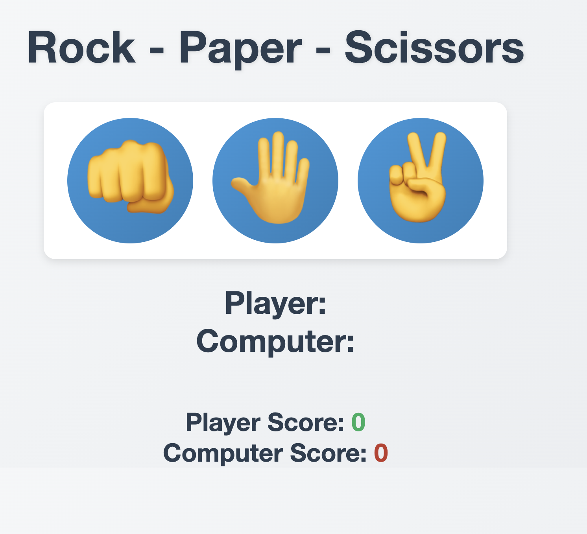
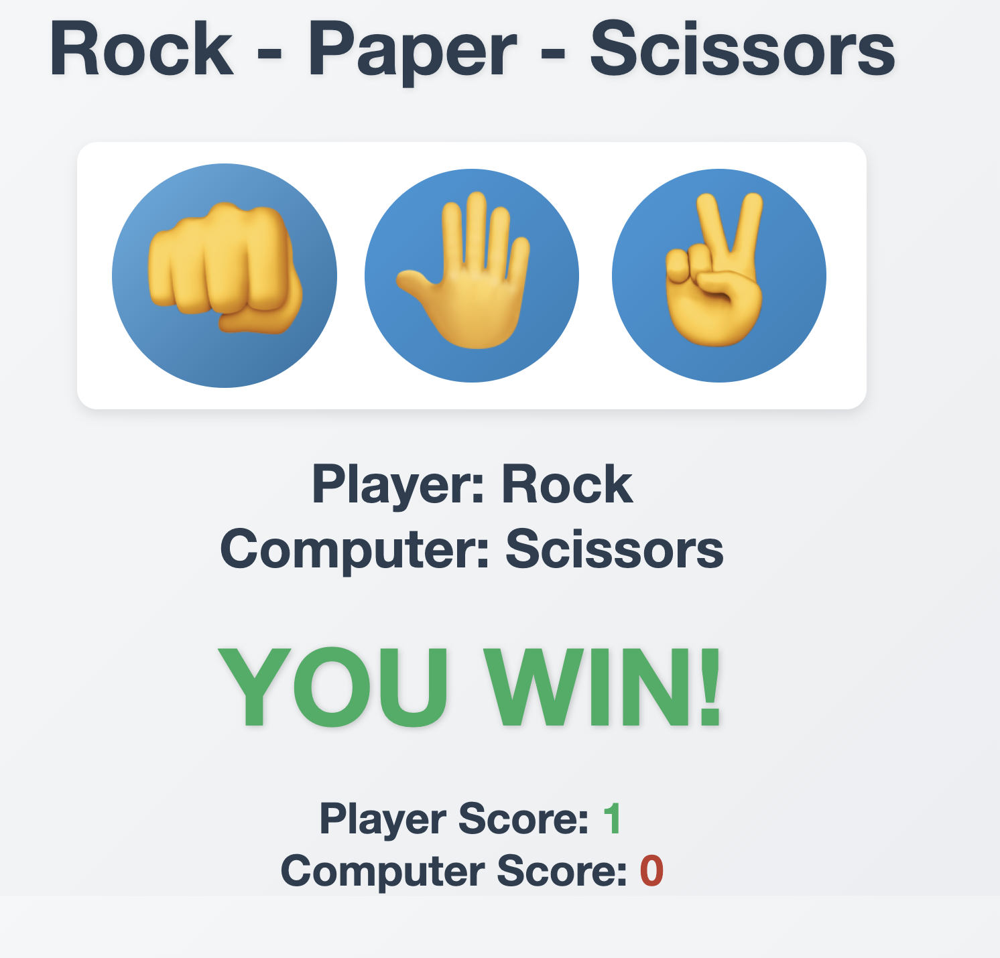
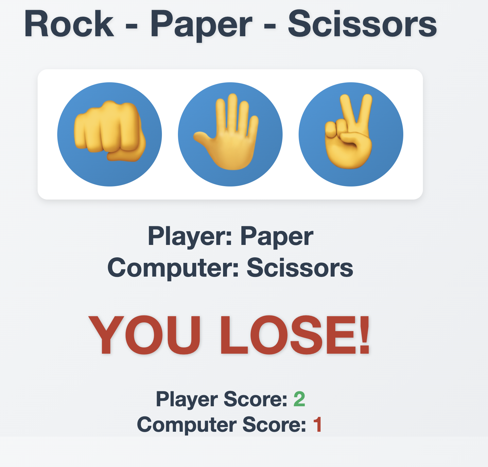
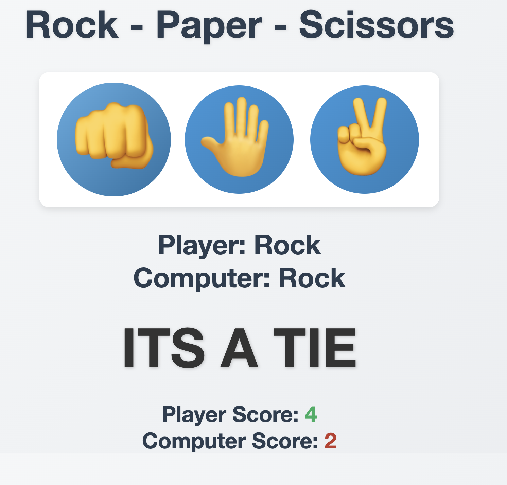

# **Rock Paper Scissors Game 👊🤚✌️**  

## **🎮 About the Project**  
This is a **fun and interactive Rock Paper Scissors game** built using **HTML, CSS, and JavaScript**. It allows players to compete against the computer in the classic hand game. With smooth animations, stylish UI, and responsive design, this project provides an engaging experience for users of all ages!  

## **✨ Features**  
✅ **User vs Computer Gameplay** – Play against an AI opponent that randomly selects moves.  
✅ **Dynamic UI & Animations** – Stylish buttons and smooth transitions make gameplay more exciting.  
✅ **Real-time Score Tracking** – Keep track of your wins, losses, and draws.  
✅ **Responsive Design** – Works seamlessly across different screen sizes and devices.  
✅ **Interactive Feedback** – Colors and text change based on the result (win, lose, or draw).  

## **🚀 Technologies Used**  
- **HTML5** – Structure of the game  
- **CSS3** – Styling and animations  
- **JavaScript (ES6+)** – Game logic and interactivity  

## **📸 Screenshots**  
### Game Interface:

### Winning Screen:

### Losing Screen:

### If It's a tie Screen:

  

## **💡 How to Play?**  
1️⃣ Click on **Rock 🦾, Paper 🤚, or Scissors ✌️** to make your move.  
2️⃣ The computer will randomly choose its move.  
3️⃣ The game determines the winner based on traditional Rock Paper Scissors rules:  
   - **Rock beats Scissors**  
   - **Scissors beat Paper**  
   - **Paper beats Rock**  
4️⃣ Your score updates in real-time based on the result.  

